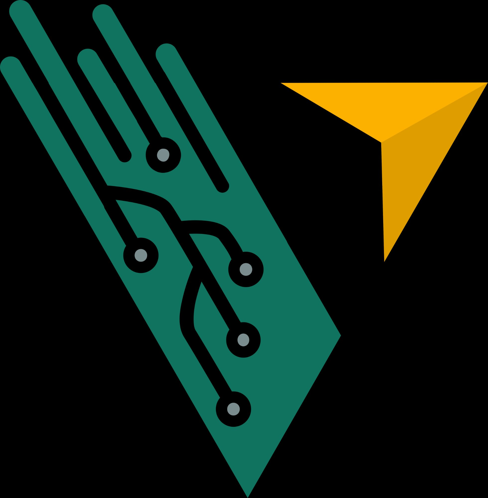

<div align="center">
  
  <h1>🚀 Vision CSE Recruitment Platform</h1>
  <p><strong>Advanced Assessment & Proctoring Environment</strong></p>
  
  [](https://nodejs.org)
  [](https://reactjs.org/)
  [](https://www.mongodb.com/)
  [](https://expressjs.com/)
  [](https://tailwindcss.com/)
</div>

---

## 📖 Overview

The **Vision CSE Recruitment Platform** is an enterprise-grade candidate assessment application designed natively for campus-level core recruitment. Engineered to evaluate advanced Data Structures & Algorithms, Full-Stack Web Development, and core CS fundamentals—the application ensures absolute assessment integrity utilizing zero-tolerance anti-cheat protocols alongside real-time proctoring sockets.

### ✨ Core Features

- **Strict Tab Tracking & Proctoring:** Zero-tolerance browser bounds monitoring. Single-strike tab switching or unfocusing triggers immediate, irrevocable auto-submission enforcing strict integrity.
- **Native Fullscreen Hooking:** Browser APIs forcibly expand and rigidly lock exactly upon MCQ test initialization, stopping external visibility.
- **Automated SMTP Account Verification:** Embedded JWT-based pipeline hooking into Nodemailer parsing localized verification dispatches bounding accounts directly to University domains.
- **Real-Time Admin Sockets:** Instant bidirectional telemetry parsing candidate violation flags natively onto the admin board.
- **Live Code Execution:** Pre-configured architecture scaling seamlessly onto standard compiler API microservices (e.g. Judge0).
- **Glassmorphic Premium UI/UX:** A highly tailored, immersive "Dark Mode" aesthetic engineered exclusively for sophisticated assessment interfaces.

---

## 🛠️ Technology Stack

**Frontend Architecture:**
- React.js (v18+)
- Socket.IO Client (Real-time architecture)
- Tailwind CSS (Pre-compiled highly optimized styling)
- React Router DOM
- React Hot Toast 

**Backend Architecture:**
- Node.js & Express.js
- MongoDB (Mongoose ORM)
- JSON Web Tokens (Secure stateless handling)
- Nodemailer (Automated Email Auth)
- Crypto (Token signatures)

---

## 🚀 Local Deployment Setup

### 1. Database & Environment Configuration

Ensure you map an active Database target using [MongoDB Atlas](https://cloud.mongodb.com/). 

Create a `.env` file explicitly in the `server/` root directory:

```env
# Database Credentials
MONGO_URI=mongodb+srv://<admin>:<password>@cluster0.xxxx.mongodb.net/vision-oa?retryWrites=true&w=majority

# Security Architecture
JWT_SECRET=super_secure_randomized_cryptographic_hash_64_byte
PORT=5000

# Client Configuration
CLIENT_URL=http://localhost:5173
NODE_ENV=development

# SMTP Configuration (Candidate Account Email Verification)
SMTP_EMAIL=your-corporate-email@gmail.com
SMTP_PASSWORD=your-google-app-password
```

### 2. Dependency Initialization

Execute module installations strictly across both micro-directories.

```bash
# Initialize API Backend
cd server
npm install

# Initialize Client Frontend
cd ../client
npm install
```

### 3. Database Seeding

Inject dummy candidate tests alongside configuring the default master Administrator identity natively.

```bash
cd server
npm run seed
```
> **Default Admin Root Access:** `admin@visioncse.com` / `Admin@123`

### 4. Running the Development Servers

Fire up the development environment across independent terminal hosts.

**Host 1 (Backend API & Socket Listener):**
```bash
cd server
npm run dev
# Expected output: "✅ MongoDB Atlas Connected"
```

**Host 2 (React Vite Engine):**
```bash
cd client
npm run dev
# Expected output: Network UI serving locally at http://localhost:5173
```

---

## 🔒 Security Best Practices for Production

Before launching into a live production domain, ensure your configurations strictly enforce the following protocols:

1. **Purge Seed Accounts:** Delete `admin@visioncse.com` and generate a unique Master Administrator account hooked to your core domain.
2. **Network Whitelisting:** Strictly bound your MongoDB Atlas Network rules dropping `0.0.0.0/0` in favor of your AWS / DigitalOcean / Vercel dedicated outbound IP addresses.
3. **App Passwords:** Do not utilize raw passwords for Nodemailer SMTP. Generate deterministic app-specific application keys utilizing your email provider UI.
4. **JWT Rotations:** Validate that `JWT_SECRET` is completely unique, un-committed, and maps over 64 bytes.

---

> Engineered and maintained securely by the **Vision CSE Software Core Team**. All rights reserved computationally.
